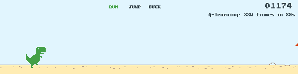

🧩 I make things, break things, and occasionally figure out why they broke.

🏗️ I've built ML systems at [Siemens](https://www.siemens.com/en-us/), wrangled startups at [AWS](https://aws.amazon.com/), and now lead AI at [Critical Software](https://criticalsoftware.com/en).

🌱 I'm on a mission to bring ML to high‑stakes domains and build AI that solves real problems for **real** people.

🦹🏼‍♂️ As you're reading this, I'm probably out there in the world doing something mildly heroic, questionably wise, or both.

📫 **Want to say `HELO`?** Find me on [LinkedIn](https://www.linkedin.com/in/jgalego/) (fast), ~~send me an email~~ (please don't!) or use a [carrier pigeon](https://www.rfc-editor.org/rfc/rfc1149).

## 🤗 Models & Spaces

### [Ethos](https://huggingface.co/collections/jgalego/ethos-6ac0d16dd6ad1f928af4a0e2)

Tools and datasets for looking at how models portray people.

| Item | Type | Tags | Description |
|---|---|---|---|
| [timbre-explorer](https://huggingface.co/spaces/jgalego/timbre-explorer) | Space | `gradio` | Hear how occupation prompts change TTS voices |

### [Petiscos](https://huggingface.co/collections/jgalego/petiscos-6abfae9d9d400e984e1a9015)

Small models pre-trained from scratch on a budget.

| Item | Type | Tags | Description |
|---|---|---|---|
| [eca](https://huggingface.co/jgalego/eca) | Model | `pytorch` `safetensors` `portuguese` `literature` `from-scratch` | Small GPT pre-trained from scratch on the collected works of the Portuguese novelist Eça de Queirós, from the jgalego/eca-queiros dataset. Byte-level BPE tokenizer trained on... |

### [Dialectic](https://huggingface.co/collections/jgalego/dialectic-6abede6b14dd63f3f6a5914e)

Models for underrepresented languages and dialects.

| Item | Type | Tags | Description |
|---|---|---|---|
| [amalia-desenrasca-9b](https://huggingface.co/jgalego/amalia-desenrasca-9b) | Model | `transformers` `safetensors` `llama` `text-generation` `tool-calling` | amalia-llm/AMALIA-9B-0626-SFT fine-tuned to call tools, with prompts in European Portuguese (pt-PT). Desenrascanço is the Portuguese art of improvising your way out of a mess. |
| [desenrasca-demo](https://huggingface.co/spaces/jgalego/desenrasca-demo) | Space | `gradio` | AMALIA calls tools in European Portuguese |

### [Beyond](https://huggingface.co/collections/jgalego/beyond-6abe91c02ac3b7e9ef59fae2)

Small models past the standard transformer.

| Item | Type | Tags | Description |
|---|---|---|---|
| [trm-sudoku-extreme](https://huggingface.co/jgalego/trm-sudoku-extreme) | Model | `safetensors` `sudoku` `recursive-reasoning` `trm` `arxiv:2510.04871` | Tiny Recursive Model (TRM) trained from scratch to solve Sudoku-Extreme puzzles. One small network recursively refines a latent state and an answer, from Less is More: Recursive... |
| [breakout-world-model](https://huggingface.co/jgalego/breakout-world-model) | Model | `pytorch` `safetensors` `world-model` `diffusion` `atari` | A diffusion world model of Atari Breakout, trained from scratch. Given the last 4 frames and actions, a small U-Net denoises the next 64×64 frame; fed its own frames, it... |
| [buridan-2b](https://huggingface.co/jgalego/buridan-2b) | Model | `peft` `safetensors` `decision-model` `pointer-head` `calibration` | A decision model: it picks one of the options it is given and says how sure it is, in one forward pass, without generating text. A replication of Strands Decider on... |
| [doom-world-model](https://huggingface.co/jgalego/doom-world-model) | Model | `pytorch` `safetensors` `world-model` `diffusion` `doom` | A diffusion world model of Doom, trained from scratch on the first level of Freedoom (E1M1) in ViZDoom. Given the last 4 frames and actions, a small U-Net denoises the next... |
| [buridan-demo](https://huggingface.co/spaces/jgalego/buridan-demo) | Space | `gradio` | Pick one option from a text and say how sure |
| [space-invaders-world-model](https://huggingface.co/jgalego/space-invaders-world-model) | Model | `pytorch` `safetensors` `world-model` `diffusion` `atari` | A diffusion world model of Atari Space Invaders, trained from scratch. Given the last 4 frames and actions, a small U-Net denoises the next 64×64 frame; fed its own frames, it... |
| [ms-pacman-world-model](https://huggingface.co/jgalego/ms-pacman-world-model) | Model | `pytorch` `safetensors` `world-model` `diffusion` `atari` | A diffusion world model of Atari Ms. Pac-Man, trained from scratch. Given the last 4 frames and actions, a small U-Net denoises the next 64×64 frame; fed its own frames, it... |
| [trm-sudoku-demo](https://huggingface.co/spaces/jgalego/trm-sudoku-demo) | Space | `gradio` | Watch a 5M-parameter model solve Sudoku step by step |
| [fly-whisperer](https://huggingface.co/spaces/jgalego/fly-whisperer) | Space | `static` | Sneak up on a fruit fly, then teach its brain a smell |

### [Proven](https://huggingface.co/collections/jgalego/proven-6abe90a134980683d512387d)

Small models whose output is checked by a compiler, prover or model checker.

| Item | Type | Tags | Description |
|---|---|---|---|
| [ada-coder-qwen2.5-1.5b](https://huggingface.co/jgalego/ada-coder-qwen2.5-1.5b) | Model | `transformers` `safetensors` `qwen2` `text-generation` `ada` | Qwen/Qwen2.5-Coder-1.5B-Instruct fine-tuned with LoRA to write Ada 2022 and SPARK code from a task description, spec or signature. |
| [ada-coder-qwen2.5-7b](https://huggingface.co/jgalego/ada-coder-qwen2.5-7b) | Model | `transformers` `safetensors` `qwen2` `text-generation` `ada` | Qwen/Qwen2.5-Coder-7B-Instruct fine-tuned with LoRA to write Ada 2022 and SPARK code from a task description, spec or signature. |

### [Mayday](https://huggingface.co/collections/jgalego/mayday-6abe8d5db003d4dba76e7818)

Small models for aviation and safety engineering. Research aids, not certified.

| Item | Type | Tags | Description |
|---|---|---|---|
| [notam-subject-qwen3.5-0.8b](https://huggingface.co/jgalego/notam-subject-qwen3.5-0.8b) | Model | `transformers` `safetensors` `qwen3_5_text` `text-generation` `aviation` | Qwen/Qwen3.5-0.8B fine-tuned with LoRA to name the subject of a NOTAM: one of the 13 classes in DEEL-AI/NOTAM. |
| [reqlint-smollm3-3b](https://huggingface.co/jgalego/reqlint-smollm3-3b) | Model | `transformers` `safetensors` `smollm3` `text-generation` `requirements-engineering` | HuggingFaceTB/SmolLM3-3B fine-tuned with LoRA to check a requirement for common writing defects and rewrite it in EARS form. Where the rewrite needs information the original... |
| [c172-flight-dynamics](https://huggingface.co/jgalego/c172-flight-dynamics) | Model | `pytorch` `safetensors` `aviation` `world-model` `flight-dynamics` | A small world model of a Cessna 172 in flight. Given the last 4 aircraft states and stick commands, it predicts the state 0.1 s later; fed its own predictions, it flies the... |
| [ppo-turn-heading-cessna172p](https://huggingface.co/jgalego/ppo-turn-heading-cessna172p) | Model | `stable-baselines3` `aviation` `jsbsim` `gymnasium` `ppo` | A PPO agent that flies a Cessna 172P in the JSBSim flight dynamics model. It starts on a random heading at 5,000 ft and has to turn onto a random target heading and hold... |
| [notam-subject-demo](https://huggingface.co/spaces/jgalego/notam-subject-demo) | Space | `gradio` | Classify NOTAM text into its main aviation subject |
| [turn-heading-demo](https://huggingface.co/spaces/jgalego/turn-heading-demo) | Space | `gradio` | Pick a heading and watch a PPO agent turn a Cessna |

### [Legacy](https://huggingface.co/collections/jgalego/legacy-6abfaa376352ca4f9772f255)

Older models, datasets and Spaces.

| Item | Type | Tags | Description |
|---|---|---|---|
| [rl_course_vizdoom_health_gathering_supreme](https://huggingface.co/jgalego/rl_course_vizdoom_health_gathering_supreme) | Model | `sample-factory` `tensorboard` `deep-reinforcement-learning` `reinforcement-learning` | A(n) APPO model trained on the doom_health_gathering_supreme environment. |
| [llava-onevision-qwen2-0.5b-ov-hf](https://huggingface.co/jgalego/llava-onevision-qwen2-0.5b-ov-hf) | Model | `transformers` `onnx` `safetensors` `llava_onevision` `image-text-to-text` | This repository contains code and instructions for deploying the LLaVA-OneVision multimodal model on Amazon SageMaker using the Hugging Face Inference Toolkit. |
| [tokenizers-languages](https://huggingface.co/spaces/jgalego/tokenizers-languages) | Space | `gradio` | Comparing LLM tokenizers in multiple languages |

> 🧪 More experiments live on Hugging Face: browse all my [models](https://huggingface.co/jgalego/models) and try the full collection of [Spaces](https://huggingface.co/jgalego/spaces).

## 🚀 Notable Contributions

**[@langchain-ai/langchain](https://github.com/langchain-ai/langchain)** — The agent engineering platform. 
  

**[@ScrapeGraphAI/Scrapegraph-ai](https://github.com/ScrapeGraphAI/Scrapegraph-ai)** — Python scraper based on AI 
  

**[@huggingface/smolagents](https://github.com/huggingface/smolagents)** — 🤗 smolagents: a barebones library for agents that think in code. 
  

**[@highlightjs/highlight.js](https://github.com/highlightjs/highlight.js)** — JavaScript syntax highlighter with language auto-detection and zero dependencies. 
  

**[@bendlang/bend](https://github.com/bendlang/bend)** — Bend 2: a fast language that blocks AI mistakes via proof. Install: curl -fsSL https://bend-lang.com/install.sh | sh 
  

**[@SWE-agent/SWE-agent](https://github.com/SWE-agent/SWE-agent)** — SWE-agent takes a GitHub issue and tries to automatically fix it, using your LM of choice. It can also be employed for offensive cybersecurity or competitive coding challenges. [NeurIPS 2024]  
  

**[@huggingface/text-embeddings-inference](https://github.com/huggingface/text-embeddings-inference)** — A blazing fast inference solution for text embeddings models 
  

**[@AutoCodeRoverSG/auto-code-rover](https://github.com/AutoCodeRoverSG/auto-code-rover)** — A project structure aware autonomous software engineer aiming for autonomous program improvement. Resolved 37.3% tasks (pass@1) in SWE-bench lite and 46.2% tasks (pass@1) in SWE-bench verified with each task costs less than $0.7. 
  

**[@langchain-ai/langserve](https://github.com/langchain-ai/langserve)** — LangServe 🦜️🏓 
  

**[@google-deepmind/concordia](https://github.com/google-deepmind/concordia)** — A library for generative social simulation 
  

## 🏗️ Personal Projects

**[@JGalego/awesome-safety-critical-ai](https://github.com/JGalego/awesome-safety-critical-ai)** — When the stakes are high, intelligence is only half the equation - reliability is the other ⚠️ 
  

**[@JGalego/RunNX](https://github.com/JGalego/RunNX)** — Fast, fearless, and fully verifiable ONNX runtime in Rust 🚀⚡🦀  
  

**[@JGalego/eeg-bci-tutorial](https://github.com/JGalego/eeg-bci-tutorial)** — EEG-based BCI tutorial based on MNE, SciKit-Learn and PyRiemann 
  

**[@JGalego/RAGmap](https://github.com/JGalego/RAGmap)** — A simple Streamlit application to visualize document chunks and queries in embedding space 🗺️🔍 
  

**[@JGalego/Hack-GraphRAG](https://github.com/JGalego/Hack-GraphRAG)** — Learn how to run GraphRAG pipelines backed by Amazon Bedrock using LiteLLM proxy 🌄 
 

**[@JGalego/deploy-langserve-aws](https://github.com/JGalego/deploy-langserve-aws)** — Learn how to deploy 🦜🔗 LangChain applications with 🦜️🏓 LangServe in minutes on Amazon ECS and AWS Fargate using AWS Copilot. 
  

